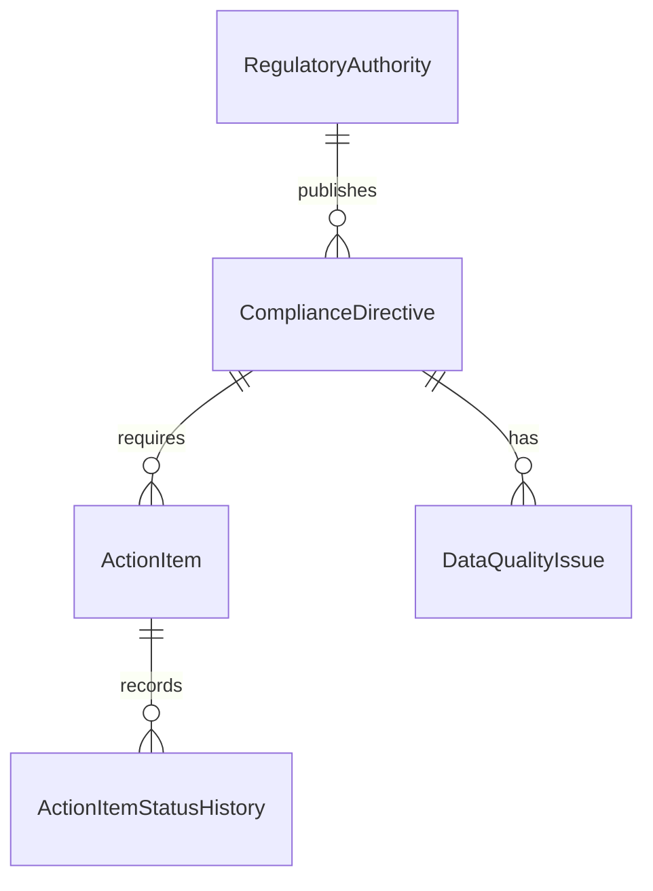

# Regulatory Intelligence Triage Pipeline

A small triage application for reviewing **simulated** regulatory updates. Compliance officers can filter directives, inspect source-quality warnings, and update action items. The data is fictional; it is not compliance advice.

## Run locally

Requires Node.js 22+, pnpm 10.17.1, and Docker Compose. From the repository root:

```sh
cp .env.example .env
pnpm install
docker compose up -d --wait
pnpm db:generate
pnpm db:migrate
pnpm db:seed
pnpm dev
```

In PowerShell, use `Copy-Item .env.example .env` for the first step. Open **http://localhost:5173**. The API listens on **http://localhost:3101**; Vite proxies `/api` to it. `pnpm dev:api` and `pnpm dev:web` can start the services separately. Stop the development servers with Ctrl+C and PostgreSQL with `docker compose down`.

Compose publishes PostgreSQL on localhost port **5433**. The credentials in Compose and `.env.example` are local development defaults, not production secrets. If 5433 is occupied, change both the Compose port and `DATABASE_URL`. `docker compose up -d --wait` waits for the database health check before migrations run.

## Structure and data model

| Path | Responsibility |
| --- | --- |
| `packages/domain` | Source normalization and business-quality checks |
| `packages/db` | Prisma schema, checked-in migrations, simulated seed |
| `apps/api` | Express routes, Zod request validation, Prisma queries |
| `apps/web` | React triage table and detail drawer |
| `docs/ai-review-log.md` | Real implementation decisions corrected during review |



Each directive belongs to one authority and retains both its normalized fields and the original source JSON/status. Actions and quality issues belong to a directive. An issue may also point to an action on that same directive. Status changes write action history in the same database transaction.

## API and triage workflow

- `GET /api/health` checks the API and database.
- `GET /api/directives` returns a bounded page. Parameters: `search`, `authority` (code such as `NMC`), `status`, `priority`, `hasIssues=true|false`, `issueSeverity=WARNING|ERROR`, `page`, `pageSize` (1–100), `sortBy`, and `sortOrder=asc|desc`. Sort fields: `publishedAt`, `effectiveAt`, `title`, `reference`, `priority`, `status`.
- `GET /api/directives/:id` returns authority, actions, issues, history, and raw source data.
- `PATCH /api/action-items/:id/status` accepts `{ "status": "PENDING" | "IN_PROGRESS" | "RESOLVED" }`.

For example, open `http://localhost:3101/api/directives?status=NEEDS_REVIEW&hasIssues=true&pageSize=10`. Use an action ID from directive detail for a PATCH. Errors have the shape `{ "error": { "code": "...", "message": "..." } }`.

The web table sends filters, sorting, and pagination to the API. Selecting a row opens its detail drawer. Resolving an action sets `resolvedAt`; reopening it clears that timestamp. The UI waits for the API response and refreshes the detail and list after a successful change.

## Source quality and validation

The seed creates **48 directives across six fictional authorities**. Deliberate cases include a missing effective date, an effective date before publication, conflicting source status, control characters and repeated whitespace, a resolved action without `resolvedAt`, an overdue pending action, and an important action without a due date. These records stay visible with explicit `DataQualityIssue` rows. The fixed seed evaluation date is 2026-10-06, so time-based flags are repeatable.

Zod validates HTTP queries, IDs, and PATCH bodies. The domain package cleans source text and applies business rules while preserving the raw input and creating quality issues for ambiguous or invalid source states. Prisma/PostgreSQL enforce canonical enums, relations, uniqueness, and status/timestamp constraints. Malformed source status does not become an arbitrary canonical string; it becomes `NEEDS_REVIEW` with an issue. Reads and action updates do not rewrite the raw source.

`pnpm db:seed` is repeatable: it replaces only the simulated feed, so rerunning it resets action edits made to those seeded records. `pnpm db:migrate` applies the checked-in migrations. `pnpm db:status` reports migration state.

## Verify

```sh
pnpm typecheck
pnpm test
pnpm build:web
pnpm db:status
```

API tests migrate a separate `api_test` PostgreSQL schema and reset their fixtures between tests; they do not replace the seeded `public` data.
